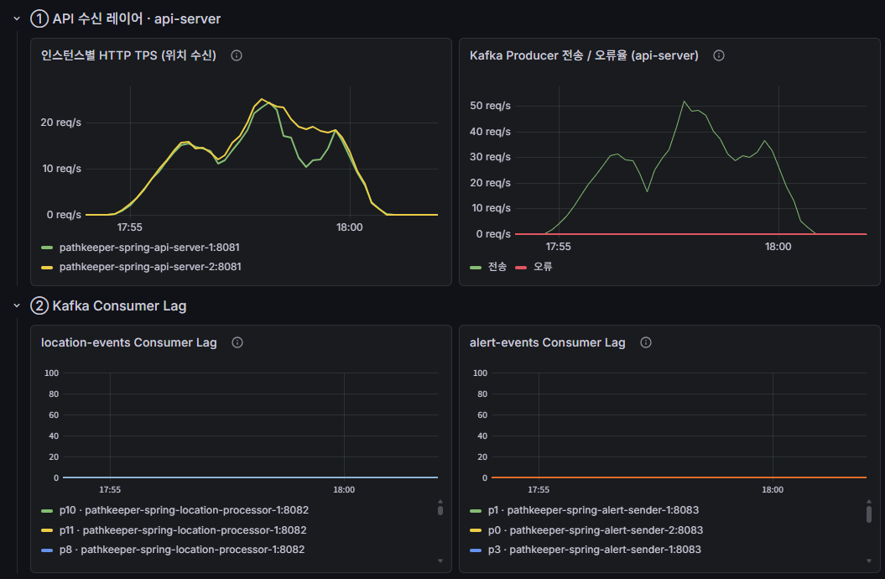
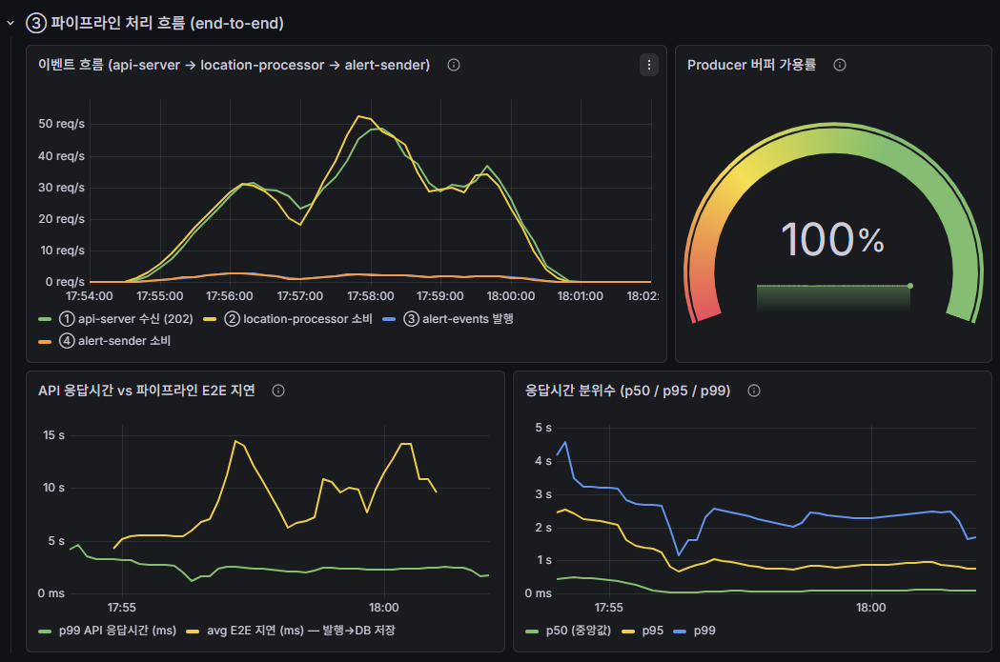
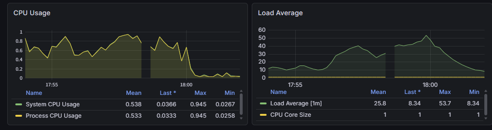
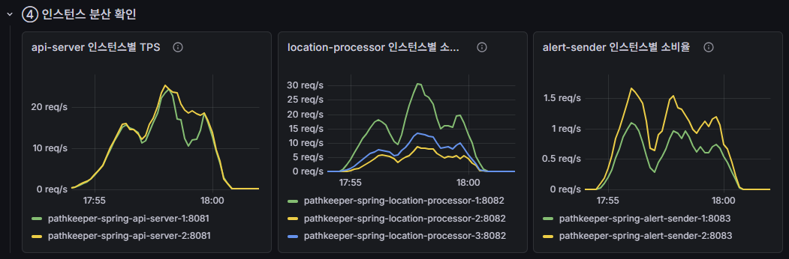
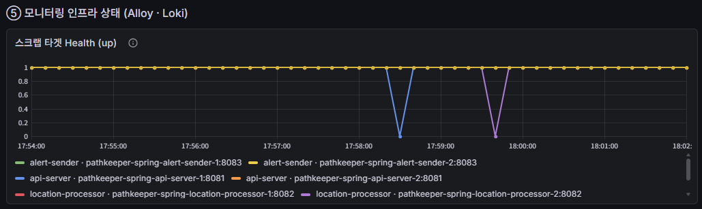

# PathKeeper
> 분산 시스템 기반 실시간 위치 추적 서비스

---

## 목차

- [프로젝트 개요]
- [시스템 아키텍처]
- [기술 스택]
- [컨테이너 구성]
- [Kafka: MSA의 메시지 브로커]
- [각 마이크로서비스의 핵심 로직]
- [부하 테스트]
- [분산 시스템 가치 입증]
- [결론]

---

## 프로젝트 개요

**PathKeeper**는 피보호자(아동, 노인)의 실시간 위치를 추적하여, 안심존 이탈 시 보호자에게 푸시 알림을 발송하는 분산 시스템 기반 위치 추적 서비스의 Spring 서버입니다.

### 핵심 기능

| 기능 | 설명 |
|---|---|
| 선행기술 검색 | OpenSearch, pgvector 기반 하이브리드 검색 (벡터 및 키워드 검색) |
| 구성요소 추출 | 사용자 입력 발명 설명에서 청구항 구성요소 자동 추출 |
| 관련성 판단 | Claude LLM으로 각 특허의 관련성 점수(0~100) 산출 |
| 신규성 분석 | 사용자 발명 구성요소와 선행기술 청구항 1:1 대비 (동일/유사/신규) |
| 진보성 분석 | 주인용/부인용 발명(선행기술) 기반 4개 진보성 논리 자동 생성 |

---

## 시스템 아키텍처

```
[피보호자 앱]
    │ HTTP POST /api/v1/locations
    ▼
[Nginx 로드밸런서]
    │
    ▼
[API Server × 2]
    │ JWT 인증 → 위경도 검증 → Kafka 비동기 발행 → 202 Accepted (즉시 클라이언트에 응답)
    ▼
[Kafka: location-events] (30 partitions, Partition Key=userId)
    │
    ▼
[Location Processor × 3] (concurrency=3, 총 9 consumer threads)
    ├─ 1. Bounding Box 검사 (Redis 캐시)
    ├─ 2. 단축 평가 (Short Circuit, 5m 임계)
    ├─ 3. PostGIS의 ST_Contains()을 통한 정밀 검사
    ├─ 4. 상태 머신 + 히스테리시스 (EXIT 3회 -> 이탈 확정, RETURN 2회 -> 복귀 확정)
    │
    ├── [Kafka: alert-events] → [Alert Sender × 2] → FCM 알림 발송
    │
    └── [Redis Stream] → [Path Persister × 1] → PostgreSQL (Bulk Insert <- 10초 간격)
```

---

## 기술 스택

| 분류 | 기술 |
|---|---|
| **언어/프레임워크** | Java 21, Spring Boot 4.0 |
| **메시지 브로커** | Apache Kafka |
| **DB & 캐시** | PostgreSQL + PostGIS, Redis |
| **모니터** | Prometheus + Grafana + Alloy + Loki |

---

## 컨테이너 구성

**문제**: 원래 기획했던 총 25개 컨테이너 동시 부팅 시, Docker 환경에 할당된 CPU 및 Memory 한계 도달해 일부 컨테이너가 실행되지 않는 문제가 발생했습니다. 학습 환경(노트북)의 제한으로 인해 실제 운영환경에서 구축하여야할 인스턴스 및 자원 할당은 불가능했습니다.

**해결**: 학습 환경으로 인해 할당할 수 있는 자원의 한계를 인정하고, 분산 시스템의 이점을 명확하게 확인할 수 있는 정도의 자원을 할당했습니다. (인스턴스 수 축소: api-server 3→2, location-processor 10→3)

이로 인해 방대한 양의 트래픽을 처리할 수 있는 MSA의 이점을 직접적으로 확인할 수 없었지만, MSA의 다른 이점들을 확인한는 것에 초점을 맞췄습니다. (장애 격리, 자원의 효율적 사용, 독립적인 인스턴스 사용)

### 애플리케이션

| 서비스 | 인스턴스 | 포트 | 역할 | CPU | Memory |
| --- | --- | --- | --- | --- | --- |
| API Server | 2 | 8081 | HTTP 수신 + Kafka 발행 | 0.5 | 512M |
| Location Processor | 3 | 8082 | 안심존 이탈 판정 | 1 | 512M |
| Alert Sender | 2 | 8083 | FCM 알림 발송 | 0.25 | 384M |
| Path Persister | 1 | 8084 | Redis Stream → DB 저장 | 0.5 | 384M |

각 서비스에 필요한 만큼의 자원(CPU, Memory)을 할당해 한정된 자원을 효율적으로 사용했습니다.

만약 MSA 환경이 아닌 모놀리식 환경이었다면, 위와 같이 각 서비스에 따른 상이한 자원 할당은 불가능합니다.

### 인프라

| 서비스 | 인스턴스 | 포트 | 역할 |
| --- | --- | --- | --- |
| Nginx | 1 | 80 | 로드밸런서 |
| kafka | 1 | 29092 | 분산 스트리밍 메시지 큐 |
| zookeeper | 1 |  | kafka 메타 데이터 저장 |
| PostgreSQL | 1 | 5432 | 데이터 저장 (DB) |
| Redis | 1 | 6379 | 데이터 캐싱 및 임시 버퍼 |

### 모니터링 도구

| 서비스 | 인스턴스 | 포트 | 역할 |
| --- | --- | --- | --- |
| Alloy | 1 | 8081 | 메트릭 및 로그 수집 및 전달 |
| Prometheus | 1 | 9090 | 메트릭 저장 |
| Loki | 1 | 3100 | 로그 저장 |
| Grafana | 1 | 3000 | 모니터링 UI |

---

## Kafka: MSA의 메시지 브로커

분산 환경에서 서비스 간 **비동기 메시지 전달**을 담당하는 메시지 브로커입니다. 

PathKeeper에서 마이크로서비스들이 서로 직접 호출하지 않고, Kafka를 통해 메시지를 주고받는 구조입니다.

### PathKeeper에서 Kafka를 선택한 이유

1. 비동기 처리로 응답성 확보
   `API Server`가 `KafkaTemplate.send()` 비동기 호출 후, 사용자에 즉시 202 응답
   → 사용자는 백엔드 처리 완료를 기다리지 않음

2. 파티셔닝으로 수평 확장 가능
   `Partition Key = userId`
   → 동일 사용자의 메시지는 같은 파티션에 순서대로 저장됨 (순서 보장)
   → 서로 다른 사용자의 메시지는 30개 파티션에 분산됨 (병렬 처리)
   → `Location Processor` 인스턴스를 늘리면 처리량 비례 증가

3. 영속성으로 메시지 손실 방지
   `Kafka`는 메시지를 디스크에 저장
   → Consumer가 죽어도 메시지가 사라지지 않음
   → 재시작 후 마지막 offset부터 다시 읽기 가능

4. 버퍼링
   부하 폭증 시 메시지가 `Kafka`에 일시 적체 (Consumer Lag 증가)
   → 사용자 응답에는 영향 없음
   → Consumer가 점진적으로 따라잡으며 Lag 해소

### PathKeeper에서의 Kafka 토픽 구조

[Topic 1] location-events (30 partitions)
- Producer: API Server
- Consumer: Location Processor (Consumer Group)
- 역할: 사용자 위치 메시지를 안심존 검사 서비스로 전달
- 키: userId → 같은 사용자 메시지는 동일 파티션에 순서대로

[Topic 2] alert-events (10 partitions)
- Producer: Location Processor
- Consumer: Alert Sender (Consumer Group)
- 역할: 이탈 확정 시 알림 발송 요청을 전달
- 키: protegeId → 같은 피보호자의 알림은 순서 보장

위치 정보와 달리 이탈 알림은 비교적 적은 빈도로 발생하기 때문에 partition을 10개만 할당하였습니다.

### 메시지 전달 보장

Kafka는 **At-Least-Once**(메시지를 최소 한 번 이상 전달)을 보장해 메시지 손실은 최소화할 수 있지만, 메시지 중복 처리 가능성이 존재합니다.

```
At-Least-Once
   ↓
   
장점: 메시지 손실 없음
단점: 중복 가능성 존재 
   ↓
   
해결:
- Alert Sender: Redis SETNX 멱등성 키로 중복 알림 차단
- Path Persister: Redis Stream PEL + XACK로 중복 INSERT 방지
```

---

## 각 마이크로서비스의 핵심 로직
### 1. `API Server`: Kafka 메시지 비동기 발행

**역할**: HTTP로 위치 수신 → JWT 검증 → Kafka 발행 → 즉시 202 응답

```java
[App] ──POST /api/v1/locations──> [API Server]
                                    │
                                    ├─ JWT 인증 (+ Spring Security)
                                    ├─ 요청 검증 (위경도 범위 검증)
                                    ├─ Kafka 발행 (비동기 호출): [Kafka location-events]
                                    └─ 202 Accepted 즉시 반환 (Kafka 응답 대기 X)
```

이로 인해 사용자는 인증 절차만 거친 후 빠른 시간 안에 응답받을 수 있고, 이후 처리 과정(이탈 여부 확인, FCM 알림 발송, 위치 정보 DB에 저장)은 백엔드에서 비동기로 진행됩니다.

### 2. `Location Processor`: 6단계 처리 파이프라인

**역할**: location-events 소비 → 안심존 이탈 판정 → 알림 발행 + 이력 저장

```java
[Kafka location-events]
   │
   ▼
[LocationConsumer]
   ├─ 1. Bounding Box 검사 (Redis)
   ├─ 2. 안전 코어 단축 평가 (Redis)
   ├─ 3. PostGIS 정밀 검사
   ├─ 4. 상태 머신 평가 (Redis)
   ├─ 5. 이탈 확정 시 → [Kafka alert-events] 발행
   ├─ 6. Redis Stream에 경로 저장
   └─ 7. ack
```

| 단계 | 컴포넌트 | 동작 |
| --- | --- | --- |
| 1 | **BoundingBoxFilter** | Redis 캐시에서 최소외접사각형 조회 → 박스 밖이면 즉시 OUTSIDE |
| 2 | **ShortCircuitEvaluator** | INSIDE 상태 + 5m 이내 이동 시 → PostGIS 검사 생략 |
| 3 | **PostGisChecker** | `ST_Contains(polygon, point)` 정밀 판정 |
| 4 | **StateMachine** | 히스테리시스 (EXIT 3회 → 안심존 이탈 확정, RETURN 2회 → 안심존 복귀 확정) |
| 5 | **AlertPublisher** | 이탈 확정 시 alert-events 발행  |
| 6 | **RedisStreamWriter** | 모든 위치를 Redis Stream에 먼저  저장 (이후 DB에 Bulk Insert로 한 번에 저장) |


**다단계 필터링 (최적화)**:

수집하는 모든 사용자 위치 정보를 매번 DB에 있는 안심존을 직접 조회하여 이탈 여부 판정하면 성능이 안 좋아집니다. 

따라서 I/O 작업을 최대한 줄이기 위해 두 단계의 필터링 작업을 먼저 수행하였습니다.

```
처리 순서:

1. Bounding Box(최소 외접 사각형)로 1차 검사: 해당 Box 밖의 좌표는 100% 이탈 (Box 안의 좌표만 다음 단계 검사 실행)

2. Short Circuit으로 2차 검사: 이전 정보가 안심존 INSIDE이고 5m 이내로 이동 한 경우, INSIDE 판정 -> DB 검사 생략

3. PostGIS(DB)로 최종 검사: 위 두 단계에서 걸러지지 않는 좌표만 DB를 조회하여 최종 이탈 여부 확인

						 ↓
      DB 부하 최소화
```

**히스테리시스 적용 (GPS 노이즈 최소화):**

```
안심존 경계에서 사용자가 이동하는 경우 
ex) 좌표 판정: OUT → IN → OUT → OUT → OUT → IN (GPS 정보가 안심존 안밖을 진동)

문제: 단순 판정 시 알림 도배 발생 (위 경우 보호자에 이탈 알림 4번 전송됨)
해결: EXIT_THRESHOLD=3 (연속 3회 OUT만 이탈로 판정 후 alert-events 메시지 저장)

						   ↓
						   
GPS 진동으로 인한 무차별 알림 최소화
```

### 3. `Alert Sender`: 멱등성 보장 이탈 알림 발송

**역할**: Kafka의 alert-events 토픽 메시지 소비 → FCM 알림 발송

```java
[Kafka alert-events]
   │
   ▼
[AlertConsumer]
   ├─ 1. 멱등성 검사 (Redis SETNX)
   │     └─ 이미 처리한 메시지면 -> ack하고 종료
   │
   ├─ 2. DB의 DepartureEvent 테이블에 기록 (notified=false)
   │
   ├─ 3. 보호자 정보 조회 (DB, 캐싱)
   │     └─ 보호자 없거나 토큰 없으면 -> ack하고 종료
   │
   ├─ 4. FCM 메시지 빌드
   │
   ├─ 5. FCM 전송 (재시도 정책 적용)
   │     ├─ 성공 → DepartureEvent.notified=true 필드 업데이트
   │     ├─ Retryable 실패-> Exponential Backoff 재시도 (2s-> 4s-> 8s-> 16s-> 30s)
   │     └─ Non-Retryable 실패 -> 토큰 무효화 + ack
   │
   └─ 6. ack
```

**멱등성:** 이미 처리한 메시지는 Redis에 표시하여, 이후 동일한 이탈 알림에 대해 중복해서 FCM 알림 X
- FCM 알림을 전송 완료 후 메시지를 ack 하기 전에 Consumer 서버가 꺼져, 재가동 후 동일 메시지에 대해 다시 FCM 알림을 전송하는 현상을 방지합니다.

**재시도:** 일시적인 장애로 FCM 전송 실패한 경우, 대기 시간을 늘려가며 5번까지 시도
- 단순 네트워크 장애는 일정 텀을 두고 다시 시도하면 성공할 수 있기 때문입니다.


### 4. `Path Persister`: Write-Behind 배치 영속화

**역할**: Redis Stream → 10초마다 배치로 PostgreSQL 적재

```java
[Redis Stream: location:buffer]
   │
   ▼
[BatchScheduler (@Scheduled 10초마다)]
   │
   ├─ 1. PEL의 미처리 메시지 읽기 (이전에 받았지만, ack 안한 메시지)
   ├─ 2. 새 메시지 읽기 (1000건까지)
   ├─ 3. PostgreSQL Bulk Insert (JDBC Batch)
   ├─ 4. XACK (Redis Stream의 PEL에서 제거)
   └─ 5. XDEL (Redis Stream에서 완전 삭제)
```

- **Write-Behind**: 최대 1000개의 위치 정보를 10초 주기로 한 번에 DB에 insert 수행→ DB 부하 최소화
  - 만약 위치 정보를 수집할 때마다 DB에 insert 하게 되면, Thread 낭비 및 DB 과부하 발생

- **PEL** 메시지 처리: 메시지를 DB에 insert 완료 후 ack하기 전 컨테이너가 죽어도, 재가동 후 해당 메시지를 정상적으로 처리 가능합니다.
  - ack 안 된 메시지는 PEL에 계속 저장되기 때문

---

## 부하 테스트

### 테스트 환경

| 항목 | 설정 |
| --- | --- |
| **도구** | Grafana K6 |
| **VU 단계** | 10 → 20 → 30 (피크 3분 유지) → 0 |
| **지속 시간** | 5분 30초 |
| **GPS 주기** | 0.5초 (VU당 초당 2 요청) |
| **사용자 수** | 20쌍 (Protege 20명 + Guardian 20명) |
| **좌표 패턴** | 70% INSIDE / 30% OUTSIDE (결정적) |
| **이론 최대 부하** | 30 VU × 2 req/s = **60 TPS** |
| **실측 피크 부하** | 약 50 req/s |

**핵심 설계 의도**:

```java
1. PAIR_COUNT = 20
   → 20개 userId가 각 파티션에 분산
   → 거의 모든 파티션 활성화 → 분산 효과 극대화

2. sleep(0.5)
   → 각 사용자의 GPS 정보를 평균 15초마다 수집한다 가정했을 때,
		   해당 부하 테스트는 900명의 사용자에 대한 부하를 테스트한 격
		 (60 x 15 = 900)

3. 30 VU × 3분 유지
   → 단순 스파이크가 아닌 지속 부하 상태에서
   → 분산 시스템의 안정성 검증
```

### API 수신 레이어



**관찰 결과**:

- **인스턴스별 HTTP TPS**: api-server-1과 api-server-2의 그래프가 거의 겹침
- **Kafka Producer 전송/오류율**: **오류 0**
- **Consumer Lag**: location-events, alert-events 모두 **0 유지**

**해석**:

1. Nginx 로드밸런서 정상 작동 (2개의 api-server 인스턴스에 트래픽 균등 분산됨을 확인)

2. 메시지 손실률 0% 

해당 지표로 분산 시스템에서 **부하 분산과 메시지 신뢰성**을 입증할 수 있습니다.

### 파이프라인 처리 흐름



#### 이벤트 흐름 (E2E)

1. api-server: 사용자 요청 수신 및 location-events 메시지 발행
2. location-processor: location-events 발행되면 곧이어 바로 해당 메시지 소비함을 확인 가능
3. location-processor: alert-events 발행
4. alert-sender: alert-events 발행되면 곧이어 바로 해당 메시지 소비함을 확인 가능

- 1번과 2번, 3번과 4번이 각각 1 대 1 매칭됨을 확인 가능
- Kafka 중간 단계 누락 없이 E2E 흐름이 정상 작동함을 입증할 수 있습니다.

#### API 응답시간 vs E2E 지연

- 사용자 관점 (초록 선 ): 2 ~ 3초
  - 위치 전송 → 3s 안에 202 응답
  - 앱은 비교적 빠르게 반응

- 백엔드 관점 (노랑 선): 10 ~ 15초
  - 같은 메시지가 DB에 저장되기까지 10~15초
  - Path Persister의 10초 배치 주기 때문

-> 두 시간의 격차가 비동기 처리의 이점을 시각적으로 입증합니다.

만약 해당 로직을 동기식으로 구현했다면, 배치 주기를 배제하더라도 사용자는 응답값을 받기 위해 최대 5초를 더 기다려야 하는 상황이 발생됩니다.

#### 응답시간 분위수 (p50/p95/p99)

| 분위수 | 측정값 | 평가 |
| --- | --- | --- |
| p50 (중간값) | ~30ms | 매우 양호 |
| p95 | 1~3초 | 다소 높음 |
| p99 | 1~5초 (안정 후 ~2초) | 학습 환경 한계 |

**p99 2초의 원인 분석**:



```java
이상적 비동기 발행 API: < 100ms
현재 측정: ~3초

원인: 학습 환경 자원의 한계 (CPU 부족)
 - Docker Desktop: 4 core
 - 16개의 컨테이너 동시 운영
 - Load Average 최대 53 관찰 (CPU 1개 기준)
 - 일부 요청이 CPU 대기 큐에서 지연됨을 확인 가능

코드 자체의 문제가 아니라
인프라 자원 한계로 인해 응답 시간이 지연된 결과

					   ↓
					   
운영환경에서 더 많은 CPU를 할당한다면, p99 100ms 이내 달성 가능할 것으로 예상
```

### 인스턴스 분산 확인



#### api-server 인스턴스별 TPS

- api-server-1: ~22 req/s 피크
- api-server-2: ~22 req/s 피크
-> 두 선이 거의 완벽히 겹침: Nginx least_conn 완벽 작동함을 확인 가능

#### location-processor 인스턴스별 소비율

- location-processor-1: ~30 req/s
- location-processor-2: ~10 req/s
- location-processor-3: ~12 req/s

가장 많은 기능을 담당해 병목 위험성이 있는 locaiton-processor는 3개의 인스턴스를 띄워 부하를 분산하였습니다.

#### alert-sender 인스턴스별 소비율

- alert-sender-1, 2 거의 균등

### 장애 독립성 확인



- 발생 상황
  1. 부하테스트 도중 api-server 인스턴스와 location-processor 인스턴스가 다운됨을 확인
  2. 분산 시스템 설계로 인해 해당 인스턴스의 장애가 다른 인스턴스에 영향 X
  3. 사용자 요청은 동일 기능을 수행하는 다른 인스턴스들에 의해 정상 처리 (애플리케이션은 큰 병목없이 지속됨)

모놀리식이었다면 하나의 인스턴스 다운은 E2E 전체 로직 수행을 불가능하게 만드므로, 트래픽 처리량이 급격하게 감소했을 것

### 결과 요약

| 지표 | 측정값 | 임계치 | 평가 |
| --- | --- | --- | --- |
| 메시지 손실률 | **0%** | < 1% | ✅ |
| Kafka Consumer Lag | **0 유지** | < 1,000 | ✅ |
| Producer 버퍼 가용률 | **100%** | > 50% | ✅ |
| 처리량 | **50 req/s** | 목표 60 TPS | ✅ |
| 응답시간 p50 | **30ms** | < 100ms | ✅ |
| 응답시간 p99 | **~3초** | < 1초 | 자원 한계 |
| E2E 지연 (avg) | **10~15초** | 배치 간격(10초)에 따른 자연스러운 결과 | ✅ |

---

## 분산 시스템 가치 입증

### 모놀리식 vs MSA

| 영역 | 기존 모놀리식의 한계 | MSA으로 얻은 이점 |
| --- | --- | --- |
| **확장 단위** | 전체 앱 통째로 복제 | 병목 서비스만 선택적 확장 |
| **장애 격리** | 한 곳 OOM → 전체 다운 | 한 서비스 죽어도 다른 서비스 정상 |
| **자원 효율** | 모든 인스턴스가 모든 기능을 위한 메모리 점유 | 각 인스턴스가 수행하는 기능에 따라 필요한 만큼의 자원만 할당 가능 |

---

## 결론

**MSA 환경**으로 확장 가능한 구조를 구현해, 구분되는 각 로직을 분리된 각각의 인스턴스가 담당하게 하여

1. 특정 인스턴스에 장애가 발생해도 다른 인스턴스에 전파되지 않은 **독립성**을 갖추게 되었고,
2. 각 인스턴스에 필요한 만큼의 자원을 할당해 자원을 효율적으로 사용할 수 있었고,
3. 병목이 발생하는 인스턴스만 부분적으로 확장할 수 있었습니다.

또한 2학기에는 

1. AWS를 통해 실제 운영환경에 알맞은 자원을 할당하여 분산 시스템의 이점인 방대한 양의 트래픽 처리를 가능하게 하고,
2. **MSA의 환경에 필수적인 쿠버네티스 환경**을 구현하여 실시간으로 변하는 트래픽 양에 따라 **필요한 특정 인스턴스 수만 동적으로 조절**하는 자동화 과정을 설계할 예정입니다.

